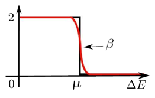

Introduction
---------------

Overview
==============

The Pole EXpansion and Selected Inversion (PEXSI) method is a fast 
method for electronic structure calculation based on Kohn-Sham density
functional theory.  It efficiently evaluates certain :ref:`selected elements <defSelectedElem>` 
of matrix functions, e.g., the Fermi-Dirac function of the KS
Hamiltonian, which yields a density matrix.  It can be used as an
alternative to diagonalization methods for obtaining the density, energy
and forces in electronic structure calculations.  The PEXSI library is
written in C++, and uses message passing interface (MPI) to parallelize
the computation on distributed memory computing systems and achieve
scalability on more than 10,000 processors. 

From numerical linear algebra perspective, the PEXSI library can be
used as a general tool for evaluating certain :ref:`selected elements <defSelectedElem>`
of a matrix function, and therefore has application
beyond electronic structure calculation as well.

Given a sparse square matrix :math:`A` and a certain function
:math:`f(\cdot)`, the basic idea of PEXSI is to
expand :math:`f(A)` using a small number of rational functions (pole expansion)

.. math::
  f(A) \approx \sum_{l=1}^{P} \omega_l(A-z_l I)^{-1}

and to efficiently evaluate :math:`f(A)_{i,j}` by evaluating selected
elements :math:`(A-z_l I)^{-1}_{i,j}` (selected inversion).

The currently supported form of :math:`f(\cdot)` include:

 - :math:`f(z)=z^{-1}`: Matrix inversion.  Since the matrix inversion is
   already represented as a single term of rational function (pole), no
   pole expansion is needed.  The selected inversion method can be
   significantly faster than directly inverting the matrix and then
   extract the selected elements of the inverse.
   For only using PEXSI to evaluate selected
   elements of :math:`A^{-1}`, see :ref:`Selected Inversion of complex  
   <pagePselinvComplex>` for an example.

 - :math:`f(z)=\frac{2}{1+e^{\beta (z-\mu)}}`: Fermi-Dirac function.  This can be
   used as a "smeared" matrix sign function at :math:`z=\mu`, without
   assuming a spectral gap near :math:`z=\mu`.  This can be used for
   evaluating the electron density for electronic structure calculation.
   See :ref:`Solving Kohn-Sham DFT: I <pageDFT1>` for an example using PEXSI for electronic
   structure calculation. 

    Red: Fermi-Dirac function. Black: Matrix sign function

For sparse matrices, the PEXSI method can be more efficient than the widely used
:ref:`Diagonalization method <diag-anchor>`  for evaluating matrix
functions, especially when a relatively large number of eigenpairs are
needed to be computed in the diagonalization method.  
PEXSI can also be used to compute the matrix functions associated with
generalized eigenvalue problems, i.e.

.. math::
   f(A,B):= V f(\Lambda) V^{-1} \approx \sum_{l=1}^{P} \omega_l(A-z_l B)^{-1}

where :math:`V,\Lambda` are defined through the generalized eigenvalue
problem :math:`A V = B V \Lambda`.

PEXSI is most advantageous when a large number of processors are
available, due to the two-level parallelism.  It is most advantageous to
use PEXSI when at least 1000 cores are available, and for many problems
PEXSI can scale to tens of thousands of cores. 

For details of the implementation of parallel selected inversion used in
PEXSI,  please see

    M. Jacquelin, L. Lin and C. Yang, PSelInv -- A Distributed Memory
    Parallel Algorithm for Selected Inversion : the Symmetric Case, 
    ACM Trans. Math. Software 43, 21, 2016.

.. _diag-anchor:

**Diagonalization method** 

 - The diagonalization method evaluates a matrix function :math:`f(A)` by
   :math:`f(A) = V f(\Lambda) V^{-1}`, 
   where the orthonormal matrix :math:`V=[v_1,\ldots,v_N]`, and the diagonal matrix
   :math:`\Lambda=\mathrm{diag}(\lambda_1,\ldots,\lambda_N)` are defined through the eigenvalue problem
   :math:`A V = V \Lambda`
   It is often the case that not all eigenvalues :math:`{\lambda_i}` are
   needed to be computed, depending on the value of :math:`f(\lambda_i)`.  

.. _defSelectedElem:

**Selected elements** 

 - For structurally symmetric matrices (i.e. :math:`A_{i,j}\ne 0` implies
   :math:`A_{j,i}\ne 0`), we define the selected
   elements of a matrix :math:`B` with respect to a matrix :math:`A` as the set
   :math:`\{B_{i,j}\vert A_{i,j}\ne 0\}`. For general matrices, the selected
   elements are :math:`\{B_{i,j}\vert A_{j,i}\ne 0\}`.
   
 - A commonly used case in PEXSI is the selected elements of
   :math:`A^{-1}` with respect to a symmetric matrix :math:`A`, or simply the selected elements of
   :math:`A^{-1}`, which corresponds to the set :math:`\{A^{-1}_{i,j} \vert A_{i,j}\ne 0\}`.

PEXSI used in external packages
=================================

Please `let us know <linlin@math.berkeley.edu>`_ if PEXSI is useful for
your application or software package!

- BigDFT

    - http://bigdft.org/Wiki/index.php?title=BigDFT_website

- CP2K

    - Tutorials for compiling CP2K-PEXSI: http://www.cp2k.org/howto:compile

- DFTB+

    - https://www.dftbplus.org/

- FHI-aims

    - https://aimsclub.fhi-berlin.mpg.de/

- Quantumwise ATK

    - User manual: http://docs.quantumwise.com/manuals/Types/PEXSISolver/PEXSISolver.html

- SIESTA

    - Download link for SIESTA-PEXSI:
      https://launchpad.net/siesta

- Electronic Structure Infrastructure (ELSI) Project

    - http://www.elsi-interchange.org/webpage/

    - In the future, the support of PEXSI for electronic structure
      software packages will be provided mainly through the ELSI
      project.

License
==============
PEXSI is distributed under BSD license (modified by Lawrence Berkeley
National Laboratory).

PEXSI Copyright (c) 2012 The Regents of the University of California,
through Lawrence Berkeley National Laboratory (subject to receipt of 
any required approvals from U.S. Dept. of Energy).  All rights reserved.

Redistribution and use in source and binary forms, with or without
modification, are permitted provided that the following conditions are met:

(1) Redistributions of source code must retain the above copyright notice, this
list of conditions and the following disclaimer.
(2) Redistributions in binary form must reproduce the above copyright notice,
this list of conditions and the following disclaimer in the documentation
and/or other materials provided with the distribution.
(3) Neither the name of the University of California, Lawrence Berkeley
National Laboratory, U.S. Dept. of Energy nor the names of its contributors may
be used to endorse or promote products derived from this software without
specific prior written permission.

THIS SOFTWARE IS PROVIDED BY THE COPYRIGHT HOLDERS AND CONTRIBUTORS "AS IS" AND
ANY EXPRESS OR IMPLIED WARRANTIES, INCLUDING, BUT NOT LIMITED TO, THE IMPLIED
WARRANTIES OF MERCHANTABILITY AND FITNESS FOR A PARTICULAR PURPOSE ARE
DISCLAIMED. IN NO EVENT SHALL THE COPYRIGHT OWNER OR CONTRIBUTORS BE LIABLE FOR
ANY DIRECT, INDIRECT, INCIDENTAL, SPECIAL, EXEMPLARY, OR CONSEQUENTIAL DAMAGES
(INCLUDING, BUT NOT LIMITED TO, PROCUREMENT OF SUBSTITUTE GOODS OR SERVICES;
LOSS OF USE, DATA, OR PROFITS; OR BUSINESS INTERRUPTION) HOWEVER CAUSED AND ON
ANY THEORY OF LIABILITY, WHETHER IN CONTRACT, STRICT LIABILITY, OR TORT
(INCLUDING NEGLIGENCE OR OTHERWISE) ARISING IN ANY WAY OUT OF THE USE OF THIS
SOFTWARE, EVEN IF ADVISED OF THE POSSIBILITY OF SUCH DAMAGE.

You are under no obligation whatsoever to provide any bug fixes, patches, or
upgrades to the features, functionality or performance of the source code
("Enhancements") to anyone; however, if you choose to make your Enhancements
available either publicly, or directly to Lawrence Berkeley National
Laboratory, without imposing a separate written license agreement for such
Enhancements, then you hereby grant the following license: a non-exclusive,
royalty-free perpetual license to install, use, modify, prepare derivative
works, incorporate into other computer software, distribute, and sublicense
such enhancements or derivative works thereof, in binary and source code form.

Citing PEXSI
==============
If you use PEXSI for electronic structure calculation in general,
**please cite the following two papers.**::
    @Article{CMS2009,
      Title                    = {Fast algorithm for extracting the diagonal of the inverse matrix with application to the electronic structure analysis of metallic systems},
      Author                   = {Lin, L. and Lu, J. and Ying, L. and Car, R. and E, W.},
      Journal                  = {Comm. Math. Sci.},
      Year                     = {2009},
      Pages                    = {755},
      Volume                   = {7}
    }
    
    @Article{JCPM2013,
      Title                    = {Accelerating atomic orbital-based electronic structure calculation via pole expansion and selected inversion},
      Author                   = {Lin, L. and Chen, M. and Yang, C. and He, L.},
      Journal                  = {J. Phys. Condens. Matter},
      Year                     = {2013},
      Pages                    = {295501},
      Volume                   = {25}
    }

If you use PEXSI for selected inversion, **please also cite the following paper.**::

    @Article{TOMS2016,
      Title                    = {{PSelInv}--A distributed memory parallel algorithm for selected inversion: the symmetric case},
      Author                   = {Jacquelin, M. and Lin, L. and Yang, C.},
      Journal                  = {ACM Trans. Math. Software},
      Year                     = {2016},
      Pages                    = {21},
      Volume                   = {43}
    }

**More references on method development:**

    M. Jacquelin, L. Lin, N. Wichmann and C. Yang,  
    Enhancing the scalability and load balancing of the parallel
    selected inversion algorithm via tree-based asynchronous
    communication, IEEE IPDPS, 192, 2016 
    `link <http://arxiv.org/abs/1504.04714>`_.
    
    L. Lin, A. Garcia, G. Huhs and C. Yang, SIESTA-PEXSI: Massively parallel
    method for efficient and accurate ab initio materials simulation without
    matrix diagonalization, J. Phys. Condens.  Matter 26, 305503, 2014 
    `link <http://dx.doi.org/10.1088/0953-8984/26/30/305503>`_.
    
    L. Lin, M. Chen, C. Yang and L. He, Accelerating atomic
    orbital-based electronic structure calculation via pole expansion
    and elected inversion, J. Phys. Condens. Matter 25, 295501, 2013 
    `link <http://dx.doi.org/10.1088/0953-8984/25/29/295501>`_.
    
    L. Lin, C. Yang, J. Meza, J. Lu, L. Ying and W. E, SelInv -- An
    algorithm for selected inversion of a sparse symmetric matrix, ACM
    Trans. Math. Software 37, 40, 2011
    `link <http://doi.acm.org/10.1145/1916461.1916464>`_.

    
    L. Lin, C. Yang, J. Lu, L. Ying and W. E, A Fast  Parallel
    algorithm for selected inversion of structured sparse matrices with
    application to 2D electronic structure
    calculations, SIAM J. Sci. Comput. 33, 1329, 2011 
    `link <http://dx.doi.org/10.1137/09077432X>`_.
    
    L. Lin, J. Lu, L. Ying, R. Car and W. E, Fast algorithm for
    extracting the diagonal of the inverse matrix with application to
    the electronic structure analysis of metallic systems, 
    Commun. Math. Sci. 7, 755, 2009
    `link <http://projecteuclid.org/euclid.cms/1256562822>`_.
    
    L. Lin, J. Lu, L. Ying and W. E, Pole-based approximation of the
    Fermi-Dirac function, Chin. Ann. Math. 30B, 729, 2009 
    `link <http://dx.doi.org/10.1007/s11401-009-0201-7>`_.
    
    **Some references on applications of PEXSI**
    
    W. Hu, L. Lin, C. Yang, J. Dai and J. Yang, Edge-modified phosphorene
    nanoflake heterojunctions as highly efficient solar cells, Nano Lett. 16
    1675, 2016 
    
    W. Hu, L. Lin and C. Yang, DGDFT: A massively parallel method for large
    scale density functional theory calculations, J. Chem. Phys. 143,
    124110, 2015
    
    W. Hu, L. Lin and C. Yang, Edge reconstruction in armchair phosphorene
    nanoribbons revealed by discontinuous Galerkin density functional
    theory, Phys. Chem. Chem. Phys. 17, 31397, 2015
    
    W. Hu, L. Lin, C. Yang and J. Yang, Electronic structure of large-scale
    graphene nanoflakes, J. Chem. Phys. 141, 214704, 2014 

Developer's documentation
=========================

This document is generated with `Sphinx <http://www.sphinx-doc.org>`_.
For more detailed API routines   in C/C++/FORTRAN see the developer's
documentation generated by doxygen.  To obtain this document, type
`doxygen` under the pexsi directory, and the document will appear in the
`developerdoc` directory.

PEXSI version history
===============================================

- v1.0.1 (6/20/2018)
    - Bug fix: initialization error in  driver_fermi_complex, and
      uninitialized variables in CalculateFermiOperatorComplex

    
- v1.0 (10/22/2017)
    - Introduce PPEXSIDFTDriver2. This reduces the number of
      user-defined parameters, and improves the robustness over
      PPEXSIDFTDriver.

    - Compatible with the ELSI software package.

    - Migrate from doxygen to sphinx for documentation. The original
      doxygen format is still kept for the purpose of developers.

    - symPACK replaces SuperLU_DIST as the default solver for
      factorizing symmetric matrices.  SuperLU_DIST is still the default
      solver for factorizing unsymmetric matrices. Currently supported
      version of SuperLU_DIST is v5.1.3.

    - PT-Scotch replaces ParMETIS as the default matrix ordering
      package. ParMETIS is still supported. Currently supported version
      of PT-Scotch is v6.0

    - Support Moussa's optimization based pole expansion. 

      Moussa, J., Minimax rational approximation of the Fermi-Dirac distribution, J. Chem. Phys. 145, 164108 (2016) 

    - Pole expansion given by src/getPole.cpp generated by a utility
      file.  This allows types of pole expansions other than
      discretization of the contour integral to be implemented in the
      same fashion. 

    - Compatible with spin-polarized and k-point parallelized
      calculations.

  
- v0.10.1 (11/8/2016)
    - Bug fix:  matrix pattern for nonzero overlap matrices and missing
      option in fortran interface (contributed by Victor Yu)

- v0.10.0 (11/6/2016) 

    - Combine LoadRealSymmetricMatrix / LoadRealUnsymmetricMatrix into
      one single function LoadRealMatrix. Similar change for
      LoadComplexMatrix. The driver routines and output are updated as
      well.

    - Updated makefile (contributed by Patrick Seewald)

    - Compatible with SuperLU_DIST_v5.1.2

    - Replace the debugging with PushCallStack / PopCallStack debugging by
      Google's coredumper.

    - A number of new example driver rouintes in examples/ and fortran/ 

    - Experimental feature: Add CalculateFermiOperatorComplex function.
      The implementation corresponds to CalculateFermiOperatorReal, but
      is applicable to the case when H and S are complex Hermitian
      matrices. This feature will facilitates the future integration
      with the Electronic Structure Infrastructure (ELSI) project.

    - Experimental feature: integration with symPACK for LDLT
      factorization.

    - Bug fix: Initialization variable pstat in interface with
      SuperLU_DIST
    
    - Bug fix: Add (void*) in MPI_Allgather of sparseA.nnzLocal in
      utility_impl.hpp.

- v0.9.2 (2/29/2016) 
    - Add support for SuperLU_DIST v4.3. Starting from v0.9.2, the
      SuperLU_DIST v3.3 version is **NO LONGER SUPPORTED**.

    - Change the compile / installation to the more standard make / make
      install commands.

    - Add pole expansion C/FORTRAN interfaces that can be called
      separately.
    
    - Bug fix: remove a const attribute in CSCToCSR since it is modified
      by MPI. Add (void*) to MPI_Allgather for some compilers.
    
    - Bug fix: Mathjax is upgraded to v2.6 to support chrome rendering.

    - Add DFTDriver2 which allows only one PEXSI
      iteration per SCF iteration. This requires a careful setup of the
      inertia counting procedure.

    - In DFTDriver2, the muMinInertia and
      muMaxInertia are updated to avoid the true chemical potential to
      be at the edge of an interval.

- v0.9.0 (07/15/2015)
    - Add parallel selected inversion (PSelInv) for asymmetric matrices.
      The asymmetric matrix can be either structurally symmetric or
      fully asymmetric. 

    - Add the example routines and fortran interfaces for asymmetric
      selected inversion.

    - Simplify the interface for installation.

    - (Contributed by Patrick Seewald) Bug fix: output string for
      SharedWrite utility routine.

- v0.8.0 (05/11/2015) 
    - Improve the data communication pattern for PSelInv. The parallel scalability of PSelInv is much improved when more than 1000
      processors are used. The variation of running time among different
      instances is also reduced.

      For more details of the improvement see

      M. Jacquelin, L. Lin, N. Wichmann and C. Yang,  
      Enhancing the scalability and load balancing of the parallel
      selected inversion algorithm via tree-based asynchronous
      communication, submitted [<a
      href="http://arxiv.org/abs/1504.04714">arXiv</a>]

    - Templated implementation of a number of classes including
      SuperLUMatrix.
    - Update the structure of the include/ folder to avoid conflict when
      PEXSI is included in other software packages.
    - Update the configuration files. Remove the out-of-date profile
      options.
    - Bug fix: MPI communicator in f_driver_ksdft.f90. 

- v0.7.3 (11/27/2014)
  - Multiple patches suggested by Alberto Garcia.
    - Fix a bug in the "lateral expansion" for locating the bracket for
      the chemical potential.
    - Search for band edges of the chemical potential, which serve both
      for metals and for systems with a gap. 
    - Add a paramter (mu0 in in PPEXSIOptions) to provide the starting
      guess of chemical potential.  This can be used for the case in
      which the PEXSI solver is invoked directly, without an inertia-counting
      phase. 
    - Update the example drivers accordingly to these bug fixes.

- v0.7.2 (08/27/2014)
  - Bug fix: Two temporary variables were not initialized during the computation of the number of electrons and its derivatives. 
  - Add test matrices to the fortran/ folder as well.
  - Update the configuration files.

- v0.7.1 (07/01/2014) 
  - Bug fix: PPEXSIPlanInitialize specifics the input according to mpirank instead of outputFileIndex.
  - Bug fix: PPEXSIPlanFinalize gives floating point error due to the double deallocation of SuperLUGrid.

- v0.7.0 (05/24/2014)
  - Use PPEXSIPlan to coordinate the computation, and allows the code to be used for C/C++/FORTRAN.
  - Templated implementation and support for both real and complex arithmetic.
  - New interface routines for FORTRAN based on ISO_C_BINDING (FORTRAN 2003 and later).
  - Basic interface for KSDFT calculation, with a small number of input parameters and built-in heuristic strategies.
  - Expert interface for KSDFT calculation, providing full-control of the heuristics. 
  - Symbolic factorization can be reused for multiple calculations.
  - Enhanced error estimate for the pole expansion using energy as a guidance.

- v0.6.0 (03/11/2014) 
  - Version integrated with the SIESTA package for Kohn-Sham density functional theory (KSDFT) calculation.
  - Parallel selected inversion for complex symmetric matrices.
  - Estimate the density of state profile via inertia counting.
  - Compute the density of states and local density of states.

.. commented
  .. _pageImportantChange:
  
  Important interface changes in v0.10.0
  ========================================
  - For C users
  
    - PPEXSILoadRealSymmetricHSMatrix and PPEXSILoadRealUnsymmetricHSMatrix are combined into PPEXSILoadRealHSMatrix
  
    - PPEXSIRetrieveRealSymmetricDFTMatrix is now PPEXSIRetrieveRealDFTMatrix
  
    - For more info see c_pexsi_interface.h
  
  - For FORTRAN users
  
    - Similar to the C routines, the new routines are f_ppexsi_load_real_hs_matrix and f_ppexsi_retrieve_real_dft_matrix.
  
    - For more info see f_interface.f90
  
  - Several more "expert user" interface routines added. See c_pexsi_interface.h for more details.
  
  - NOTE: PEXSI v0.10.0 only supports SuperLU_DIST v5.1.2 or higher version. 
  
